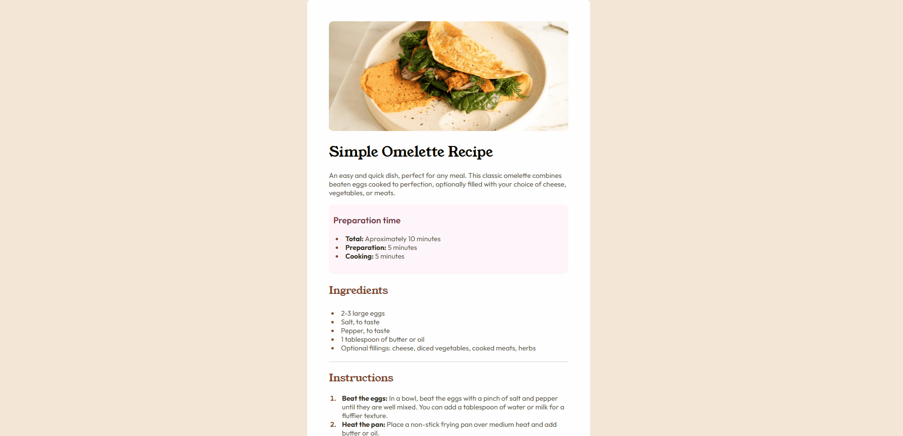
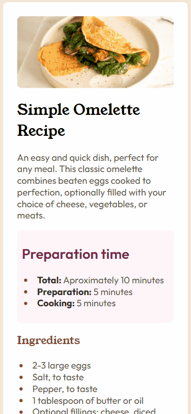

# Frontend Mentor - Recipe page solution!

This is a solution to the [Recipe page challenge on Frontend Mentor](https://www.frontendmentor.io/challenges/recipe-page-KiTsR8QQKm).

## Challenge Overview
The challenge was to build a responsive recipe page as close as possible to the design below.

## My solution

This is my desktop solution:

And my mobile solution:

### Links

- Solution URL: [solution](https://github.com/lauryne-sr/recipe-page-front-end-mentor)
- Live Site URL: [live site](https://lauryne-sr.github.io/recipe-page-front-end-mentor/)

### Built with

- Semantic HTML5 markup
- CSS custom properties
- Flexbox

### Continued development

I want to focus on responsiveness now since that was the hardest part of this project for me.

Thanks for reading! 🚀

